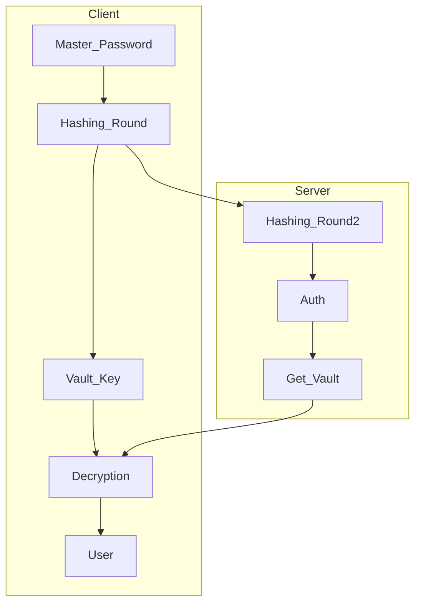

--- ---
<div style="text-align: center; ">
<p style="margin: 0px; padding: 0px;">Emilio Mendoza</p>
<a style="margin: 0px; padding: 0px;" href="https://github.com/Ironislife98/Faraday">https://github.com/Ironislife98/Faraday</a>
</div>

A self-hosted password manager would allow a user full control over their data and unrivaled freedom over their own personal data. Using hash functions such as ```SHA256``` and ```PBKDF2-SHA256``` alongside with ```AES256``` and other such encryption standards gives the user a promise of security. Users should be confident in their security and take it into their own hands.

## 1. Introduction
---
Password managers have existed under the assumption that an attacker will be stopped by the master password and the encrypted vault. However, many password managers have 2 main faults. Since password managers such as Lastpass and 1Password carry such large quantities of senstive and valueable information they are prime targets for bad actors. Large centralized password managers provide a large payout for any bad actor willing to put in the immense amount of effort needed to breach their systems. The second major problem with password managers as a whole is the master password. Keyloggers on a users system defeat the security of the master password. Multifactor authentication (MFA) is needed to secure the user from these attacks. While many password managers offer MFA, it is not the default, which must be the case to secure even the average user.

What is needed is a decentralized and self-hosted password manager with security by design with cryptographic best practices at the heart of the project. A user should be able to securely set up a server and be able to connect to it knowing they are in control of their data. In this paper, we propose a solution to the centralized password managers.  The system is secure as long as the user controls the server and client.

## 2. Key Design Principles
---

- **Privacy by Design**
	- Faraday is not motivated to collect any non-critical sensitive information. Faraday makes no money and is open-source. Collecting only critical sensitive information allows maximum privacy.
- **Trust in the Math**
	- Faraday's privacy is not based on blind trust in any one person or corporation. Faraday's trust is built in the mathematical security of crypography.
- **Code Should be Free**
	- Faraday is and will forever be open-source. The code will always be open to the public for review and usage.


## 3. Account Password
---
Faraday's security is built upon the master password. The master password is used in authenticating a user with a server, as well as decrypting the users vault.

#### Picking a Master Password
While Faraday will enforce a minimum level of security, users should make their password as strong as possible. Master passwords should long and unique mix of letters, numbers and symbols. The strength of a master password directly impacts the security of the user's data as it is used in generating keys to authenticate and decrypt their vault.

*Master passwords should never be used on any other website or app.* Users will never be asked to share their master passwords from anyone affiliated with Faraday.

#### Protecting the Master Password
Users' vaults are essentially useless to a bad actor without the users' master password. Master passwords are never sent to the server and key generation is all done locally on the clients machine.

## 4. Generating Keys and Basic Outline
---
Faraday uses the users master password to derive 2 seperate keys. One key is used in decrypting the user's vault, while the other is used in authenticating with a server. 

First the vault key is derived by concatinating the username and password used to login and hashing them. The hash function used is ```PBKDF2-SHA256``` and uses 700,000 iterations. That hash forms the vault key.

Secondly, the authentication for the server is derived from hashing the vault key and the password supplied to login. On the server the password is further hashed and salted to further obscure the vault key and the login details.

### Basic Design Diagram


## 5. Technical Design Ideas
---
 - The multiple rounds of hashing protect the user and provide a *zero-knowledge* architecture. 
 - All communications between client and server should be end-to-end encrypted (E2EE) without the cost of time. TLS encryption needs to be used along with diffie-hellman key exchange.
 - The backend language doesn't matter but it should be an API to allow expansion to multiple different clients and platforms.
 - The database will be SQL.
 - A  ```config.faraday.json``` file will be available with the ability to change the location of the SQL database (local or hosted) and other configurations like salts.

## 6. Example
---
-  Client supplies master password ```password1``` and username ```user1```
- Password is hashed with salt ```salt1``` and comes out ```587afa7ea2cd0ec5658bfac7bb28ebb9632b42dc7adf4df13d39d5b76647548a```
- This forms the vault key and is appended with the master password and using the salt ```salt2 ``` making, returning ``6fb87a80d008bf2dc63091d6c978dfa7d8e4a2575bc148433de51eec0929767d``
- The user is then authenticated with the server and the vault is sent back to to the user
- Assume a json object as the vault (just for example)
```json
{
    "user": "testuser",
    "password": "passwordtest"
}
```
- The server will return ``c36537ea514f55809e5157fb9727d3d353197f57d37f607438457f8dca1d110604ee9832d1eb0399869a9877346a79a4f2dc6635d1e2ba9549ed0aa75621f376`` which will be decrypted into the above json code
- The user has securely authenticated with the server and gotten their vault

